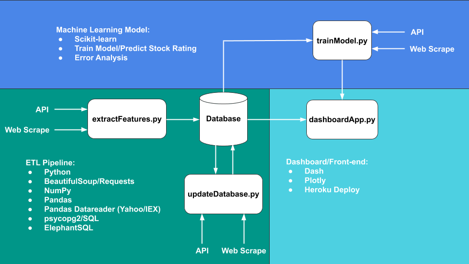

# Stock Portfolio Dash App

The Figure below illustrates the end-to-end project pipeline from the Extract, Transform, and Load (ETL) process of features to migrating the data to a relational database to training and predicting a machine learning model and visualizing the data into a dashboard application on the web.

## Getting Started

The Stock Portfolio Dash App has been deployed on Heroku. The Dash App can be found here, https://stock-portfolio-dash-app.herokuapp.com/

The Stock Portfolio Dash App is an end-to-end stock watcher dashboard application that utilizes machine learning to predict the rating of a stock against the rating the stock is given by analysts in the industry. This repository consists of 4 main components:
  - The front-end stock portfolio dashboard built using Plotly and Dash
  - The Extract, Transform, and Load (ETL) process to extract features using Python and SQL
  - Training the machine learning model and using it to predict stock ratings
  - Error Analysis of the machine learning model

## Front-end Dash App

The front-end [Dash Application](./dashboardApp.py) consists of two main components, the portfolio table/figure and the watchlist table/figure.
The portfolio table takes in an input of the stock ticker, price of the stock, and the number of shares to calculate and display the value of the stock and its returns. The total portfolio return of all stocks is displayed in a table and a figure and accounts for the total cumulative return. The view of the figure can be changed by date ranges, and it goes from 7 days, to 30 days, to 60 days to 90 days, to 365 days, displaying the cumulative returns of the portfolio in that timeframe.
The watchlist table takes in an input of the stock ticker and displays the price and price movements. The view of the figure can be changed by date ranges, and it goes from 7 days, to 30 days, to 60 days to 90 days, to 365 days, displaying the stock price chart in that timeframe.

Both the portfolio table and watchlist table show the predicted rating by our machine learning model and the analyst rating taken from the web.

## ETL Pipeline

The ETL pipeline mainly consists of data cleaning and data wrangling to extract features and migrate the features into a relational database. By using web scraping and API calls we are able to extract technical and fundamental data of stocks. The raw data from the web is extracted into [features](./extractFeatures.py) and migrated into a database for later use. As the features change daily, and the prospect and ratings of stock change as well, the data used for our front-end dashboard will need to be updated. The database is [updated](./updateDatabase.py) daily by running a script on a local machine that updates the features of the stocks in our database and updates the predictions of our machine learning model.

A free SQL database can be created on ElephantSQL at https://www.elephantsql.com/

## Machine Learning Model

Using a logistic regression, one vs. all model, we train the model to predict the stock ratings and compare it to what the analysts are rating it in the market.
The labels are as follows: [Sell, Underweight/Underperform, Hold, Overweight/Overperform, Buy] ratings. We extract features based on the sector the stock is classified under, the technical moving averages of the stock prices, and fundamental stock metrics such as margins, profitability and leverage. The sectors and labels need to be encoded for the model to be able to make predictions. After cleaning the data of features, we end up with a dataset of 316. Using a 80/20 we get 253 training sets and 63 test sets.

## Error Analysis

It is important to note that trying to predict stock prices or movement of stocks is impossible due to the large number of factors and the randomness in the stock market. Also the ratings are based on the perspective of professional analysts, some of which may have different opinions, and the analysts tend to get it wrong a lot of the times. The ratings predicted by the model or the ratings given by analysts should be taken with a grain of salt and should not be the sole indicator on making investment decisions.

Running an [error analysis](./errorAnalysis.ipynb) we can assess the accuracy, precision and recall. Due to the randomness in initializing the training and test sets, the error will vary. Running the model 100 times, we can see an average accuracy rate of 46%.
Running a classification report on one of the trials we get the following table below:

|    rating   | precision | recall    | f1-score  |
| ----------- |:---------:|:---------:|:---------:|
| Buy         | 0.00      | 0.00      | 0.00      |
| Hold        | 0.50      | 0.48      | 0.49      |
| Overweight  | 0.55      | 0.78      | 0.64      |
| Sell        | 0.00      | 0.00      | 0.00      |
| Underweight | 0.45      | 0.33      | 0.38      |

Here are a few recommended ways of improving the model's accuracy:

  1. Collecting more sample data for training and testing.

    - Currently we are working with a dataset of 316 and in the error analysis we can see that the label classifications are split as follows:

| rating        | sector        |
| ------------- |:-------------:|
| Buy           | 19            |
| Hold          | 101           |
| Overweight    | 113           |
| Sell          | 7             |
| Underweight   | 76            |

    - Our model is unable to correctly predict the Buy/Sell rated features. This is due to the distribution of our sample data were there are only 19 sets with the Buy classification and 7 sets with the Sell classification. We are currently working with a biased dataset and our model is unable to correctly predict when it comes to these cases. By collecting more distributed data, the model's accuracy will improve.

  2. Extract additional features.

    - Predicting the price or direction of a stock requires a complex model as there are so many factors that goes into determining them. By extracting additional features for the machine learning model, the model's accuracy will improve.

    The current model features are as follows:
      - Industry Sector (Encoded)
      - 1 Week Moving Average Price
      - 1 Month Moving Average Price
      - 1 Year Moving Average Price
      - Gross Profit / Revenue (Current Year/Last Year/Last 2 Years)
      - Net Profit / Revenue (Current Year/Last Year/Last 2 Years)
      - Current Ratio
      - Debt-to-Equity Ratio
      - Debt-to-Asset Ratio

  3. Optimize model using statistical analysis

    - After getting additional features, we can use statistical analysis to improve the model. For example using a backward elimination method to select significant features with the highest P-value or the highest Adjusted R-Squared value.

## License

The MIT License (MIT)

Copyright 2019 Chris Kim

Permission is hereby granted, free of charge, to any person obtaining a copy of this software and associated documentation files (the "Software"), to deal in the Software without restriction, including without limitation the rights to use, copy, modify, merge, publish, distribute, sublicense, and/or sell copies of the Software, and to permit persons to whom the Software is furnished to do so, subject to the following conditions:

The above copyright notice and this permission notice shall be included in all copies or substantial portions of the Software.

THE SOFTWARE IS PROVIDED "AS IS", WITHOUT WARRANTY OF ANY KIND, EXPRESS OR IMPLIED, INCLUDING BUT NOT LIMITED TO THE WARRANTIES OF MERCHANTABILITY, ITNESS FOR A PARTICULAR PURPOSE AND NONINFRINGEMENT. IN NO EVENT SHALL THE AUTHORS OR COPYRIGHT HOLDERS BE LIABLE FOR ANY CLAIM, DAMAGES OR OTHER LIABILITY, WHETHER IN AN ACTION OF CONTRACT, TORT OR OTHERWISE, ARISING FROM, OUT OF OR IN CONNECTION WITH THE SOFTWARE OR THE USE OR OTHER DEALINGS IN THE SOFTWARE.
